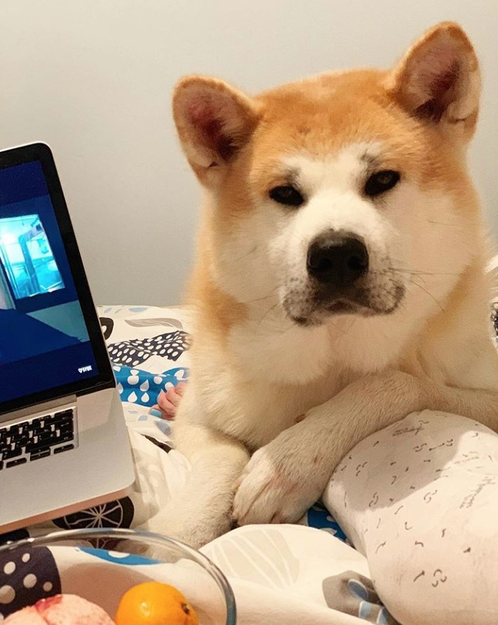

# Comtravo Challenge

This project hosts the solution for Comtravo's Backend Challenge :)

In it I will describe the process of how I decided to solve the problem, the technologies that I used and also the PRs and Testing.

Feel free to use the project as you like and to switch to any PR to see the development of any particular feature, if there is any question feel free to hit me up.


## Objective:

Your service should get flights from these 2 routes, merge them, remove duplicates and send to the
client.
As an identity of the flight can be used the combination of flight numbers and dates.
Note that discovery-stub service is not stable, i.e. it can sometimes fail or reply after couple of
seconds.
The response time of your service shouldn't take longer than 1 second.
Please write tests for your implementation. Also would be great to avoid usage of Nest.js framework.

# How did I decide to tackle the problem?

The first thing was to analyze what is being asked so I may divide this into a list of subtasks and work them independly in a seperate PR to isolate them.

After the feature decision the next one is to decide the Tech Stack, possible benefits and alternatives. In this case I decided to use Express, Swagger, Jest and other packages. Eventhough for the case of Swagger there are other alternatives like ReDoc I wanted to follow what Comtravo used as well :)

So we got our features with the list of tasks, and our tech stack! So lets get hands on coding.

# Tech stack

- Express
- Swagger
- Jest
- Superagent
- Cors
- Husky

# How to run the program?

```shell
##Execute the following commands:

git clone https://github.com/Rodolfoarv/ComtravoChallenge.git

cd ComtravoCHallenge

```

### Install the dependencies

```shell
npm install
```

### Execute the program

```shell
npm start
```

### Execute the tests

```shell
npm run tests
```

# Some notes

I have pushed the .env variable so you may test it with the credentials :) however, this is not a good practice to follow.

# Pull Request

Every "small feature" was developed in a separated pull request with the commits associated to it. This is a common practice I follow, afterwards someone reviews my PR or do a Pair Programming exercise to ensure the quality and coding standards of the feature being developed.

You may switch to a PR at anytime in which I divided it in 3 features for the project

- Connection with Comtravo's API and initial setup of the application with Express
- Creation of the Flight API (Using Swagger)
- Adding a testing framework (Jest)

## Who reviewed my PR's ?

My friend's dog was in charge with the mission of reviewing my PRs in exchange for food.



# What can be improved?

Many things and many subfeatures to add to the API, one of them is a logging system using Winston so we can record this in any case of failure :) Also adding Typescript would be useful for type checking a flight instance.

# Big Thank You

It was fun working with this project specially since I felt this is a common task that could happen when you have several partners and you need to integrate them into a single API :)
